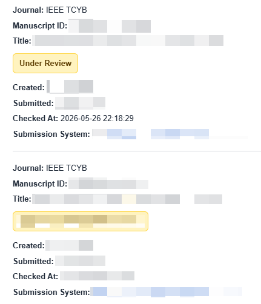
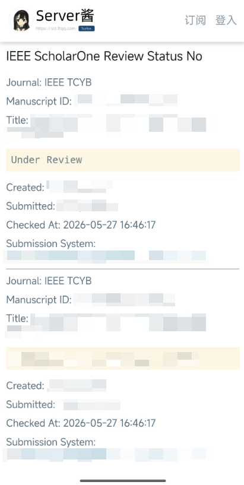
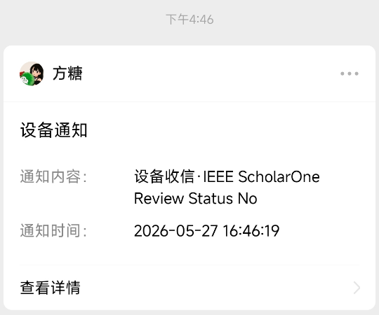

<div align="center">

# IEEE ScholarOne Status Monitor

A local status monitor for IEEE journals that use ScholarOne / Manuscript Central.

It reads manuscript status rows, stores a local snapshot, and sends notifications through Server Chan Turbo, PushPlus, or email when a baseline or status change is detected.

   

English | [中文](README.zh-CN.md)

</div>

## Features

- Monitor one or more ScholarOne / Manuscript Central journal accounts.
- Read manuscript IDs, titles, statuses, created dates, and submitted dates.
- Store the latest local snapshot in `data/status.json`.
- Detect first baselines, new manuscripts, status changes, and removed manuscripts.
- Send notifications through Server Chan Turbo, PushPlus, or SMTP email.
- Save redacted HTML and screenshots for troubleshooting failed runs.
- Reuse a persistent browser profile to reduce repeated logins and Cloudflare checks.
- Provide Windows Task Scheduler examples for unattended runs.

## Examples

Sensitive manuscript IDs, titles, and links are masked in these screenshots.

| Email | Server Chan Turbo | PushPlus / WeChat device notice |
| --- | --- | --- |
|  |  |  |

## Setup

```powershell
python -m venv .venv
.\.venv\Scripts\python.exe -m pip install -e ".[dev]"
.\.venv\Scripts\python.exe -m playwright install chromium
Copy-Item .env.example .env
Copy-Item journals.example.toml journals.toml
```

If Playwright Chromium is not installed, the scraper falls back to system Microsoft Edge.

## Journal Configuration

Edit `journals.toml`:

```toml
[[journals]]
key = "ieee-tcyb"
name = "IEEE TCYB"
platform = "scholarone"
url = "https://mc.manuscriptcentral.com/cyb-ieee"
username_env = "TCYB_USERNAME"
password_env = "TCYB_PASSWORD"
```

Fields:

- `key`: local unique journal key.
- `name`: journal name shown in notifications.
- `platform`: currently supports `scholarone`.
- `url`: ScholarOne submission system URL.
- `username_env` / `password_env`: environment variable names used to read credentials from `.env`.

To add another journal, add another `[[journals]]` entry and point `username_env` / `password_env` at different environment variable names.

## Notification Configuration

Edit `.env`. You can use WeChat-style push services or SMTP email.

### Server Chan Turbo

1. Open [Server Chan Turbo](https://sct.ftqq.com/).
2. Sign in and open the [SendKey page](https://sct.ftqq.com/sendkey).
3. Copy your `SendKey`.
4. Configure `.env`:

```dotenv
NOTIFY_PROVIDER=wechat
WECHAT_PROVIDER=serverchan
WECHAT_TOKEN=your_server_chan_send_key
```

### PushPlus

1. Open [PushPlus](https://www.pushplus.plus/).
2. Sign in and open the one-to-one push or profile page.
3. Copy your personal `token`. You can also check the [official PushPlus docs](https://www.pushplus.plus/doc/).
4. Configure `.env`:

```dotenv
NOTIFY_PROVIDER=wechat
WECHAT_PROVIDER=pushplus
WECHAT_TOKEN=your_pushplus_token
```

### Gmail Email

Gmail SMTP should use an app password instead of your normal account password.

1. Make sure 2-Step Verification is enabled for your Google Account.
2. Read the [Google App Passwords help page](https://support.google.com/accounts/answer/185833).
3. Open the [App Passwords page](https://myaccount.google.com/apppasswords).
4. Create an app password for this project.
5. Configure `.env`:

```dotenv
NOTIFY_PROVIDER=email
EMAIL_SMTP_HOST=smtp.gmail.com
EMAIL_SMTP_PORT=587
EMAIL_USERNAME=your_gmail_address@gmail.com
EMAIL_PASSWORD=your_google_app_password
EMAIL_FROM=your_gmail_address@gmail.com
EMAIL_TO=recipient1@example.com,recipient2@example.com
```

`EMAIL_TO` accepts multiple recipients separated by commas or semicolons.

### ScholarOne Credentials

Whichever notification provider you use, also configure the journal credentials referenced by `journals.toml`:

```dotenv
RUN_MODE=normal
TCYB_USERNAME=your_scholarone_username
TCYB_PASSWORD=your_scholarone_password
```

## Commands

Test notification:

```powershell
.\.venv\Scripts\python.exe -m ieee_scholarone_monitor test
```

Run a normal status check. This sends a message only when a baseline or status change is detected:

```powershell
.\.venv\Scripts\python.exe -m ieee_scholarone_monitor check
```

Send a current status report regardless of changes:

```powershell
.\.venv\Scripts\python.exe -m ieee_scholarone_monitor report
```

Run visibly for login/debugging:

```powershell
.\.venv\Scripts\python.exe -m ieee_scholarone_monitor --debug check
```

Save successful page diagnostics without changing the normal workflow:

```powershell
.\.venv\Scripts\python.exe run_monitor.py --dump report
```

This writes a screenshot, redacted HTML, and parsed table rows under `logs/dumps`.

## Cloudflare Verification

Some ScholarOne sites may show Cloudflare human verification. This project does not bypass or simulate verification clicks.

The monitor reuses browser session data under:

```text
data/browser-profile
```

If an unattended run is blocked by verification, the monitor will:

- keep the previous `data/status.json` unchanged;
- send an `IEEE ScholarOne Monitor Needs Attention` notification;
- ask you to refresh the saved browser session.

Refresh the browser session manually:

```powershell
.\.venv\Scripts\python.exe -m ieee_scholarone_monitor reauth
```

Complete the challenge in the visible browser. Later `check` / `report` runs will reuse the refreshed session.

If you need more time:

```dotenv
CHALLENGE_TIMEOUT_SECONDS=180
```

## Runtime Files

- `.env`: local secrets and behavior switches. Do not commit it.
- `journals.toml`: local journal list. Do not commit it if it contains private settings.
- `data/status.json`: latest known manuscript snapshot. Do not commit it.
- `data/browser-profile`: browser session data, possibly including cookies/sessions. Do not commit it.
- `logs/app.log`: status check logs.
- `logs/screenshots` and `logs/pages`: failure diagnostics with redacted login fields. Do not commit them.

## Scheduling

You can run the monitor on your own Windows machine or in GitHub Actions.

| Method | Best for | Notes |
| --- | --- | --- |
| Windows Task Scheduler | Personal long-running use, browser session reuse, `check` runs that notify only on changes | Keeps local `data/status.json` and `data/browser-profile`, so it works better when ScholarOne needs a saved login session. |
| GitHub Actions | Cloud-hosted daily `report` runs when direct login works without manual verification | Uses GitHub Secrets for `.env` and `journals.toml`. The runner is temporary, so generated files are not kept unless you add cache/artifact handling. |

Detailed guides:

- [Windows Task Scheduler](docs/windows-task-scheduler.md)
- [GitHub Actions scheduled reports](docs/github-actions-scheduling.md)

Common command choices:

- run `report` once a day to send a current status report.
- run `check` several times a day and notify only on changes.

## Tests

```powershell
.\.venv\Scripts\python.exe -m pytest -q
```

If your Windows temp directory has permission issues:

```powershell
$base = Join-Path (Resolve-Path .).Path (".pytest-run-" + [guid]::NewGuid().ToString("N"))
.\.venv\Scripts\python.exe -m pytest -q --basetemp $base -p no:cacheprovider
```

## Security Notes

Before publishing or committing changes, make sure these are not included:

- `.env`
- `journals.toml`
- `data/`
- `logs/`
- browser profiles
- real ScholarOne credentials
- push tokens
- email app passwords
- real manuscript IDs, titles, or diagnostic page files

Commit `.env.example` and `journals.example.toml` as templates instead.

## Disclaimer

Use this tool only in compliance with ScholarOne, journal websites, and notification provider terms. This project does not provide capabilities to bypass CAPTCHAs, bypass Cloudflare, or evade website security controls.
